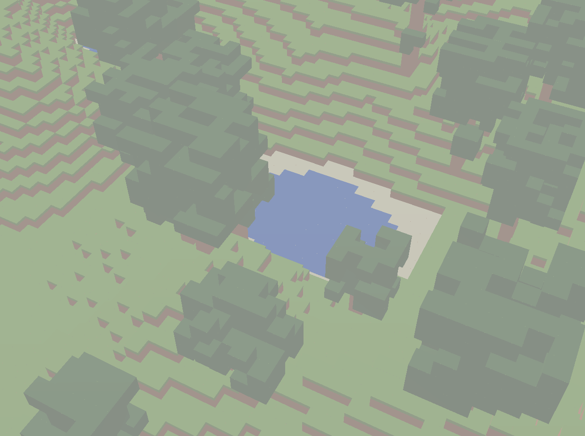

# cubeworld

a simple block world demo written in swift on OpenGLES compatible with macOS and RaspberryPI

!

borrows ideas from
* www.swiftgl.org - OpenGL tutorial in Swift
* www.glfw.org - cross platform GL window toolkit
* https://github.com/sakrist/Swift_OpenGL_Example - iOS, Linux, Android OpenGL is Swift 
* https://pygame-zero.readthedocs.io - simple python game framework
* https://gist.github.com/niw/5963798 - libpng code
* https://www.songho.ca/opengl/gl_projectionmatrix.html
* https://gamedev.stackexchange.com/questions/17171/for-voxel-rendering-what-is-more-efficient-pre-made-vbo-or-a-geometry-shader
* https://stackoverflow.com/questions/8142388/in-what-order-should-i-send-my-vertices-to-opengl-for-culling
* https://web.mit.edu/cesium/Public/terrain.pdf - terrain generation
